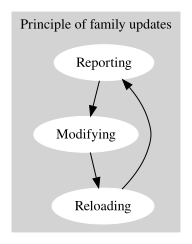

#############################################
The Chain
#############################################

Summary
=======

The chain consists of a number of main workflows aimed at en mass family updates:

- Reporting - of family properties :  

    - `REPORTING <../../_00_ReportFamilyData/_docs/HowTo_ReportFamilies.rst>`_
    - `SAVING MISSING FAMILIES <../../_00_X_SavingMissingFamilies/_docs/HowTo_SaveOutMissingFamilies.rst>`_

- Changing - Specific families with specific actions : 

    - `RENAMING <../../_01_X_RenameFamilies/_docs/HowTo_RenameFamilies.rst>`_
    - `CHANGE FAMILY CATEGORY <../../_01_Y_ChangeFamilyCategory/_docs/HowTo_ChangeFamilyCategory.rst>`_
    - `CHANGE FAMILY SUB CATEGORIES <../../_01_Z_ChangeFamilySubCategory/_docs/HowTo_ChangeFamilySubCategory.rst>`_

- Changing - All families with a default set of actions : 

    - `MODIFY DEFAULT <../../_01_ModifyFamilyChange/_docs/HowTo_ModifyFamiliesDefault.rst>`_

- Reloading - nested families into host families : HowTo_ReloadFamilies.rst

    - `RELOADING <../../_02_ModifyFamilyLibraryReloadAdvanced/_docs/HowTo_ReloadFamilies.rst>`_

Putting it all together
=======================

The batch script 'theChain.bat' executes the 3 workflows in the following order:

#. Changing
#. Reloading
#. Reporting

In between executing flows, it will copy the following files from the flow just finished to the one about to be executed:

#. Changing

    * Change list ChangedFilesTaskList.csv 
    
        * from folder:  __\_01_ModifyFamilyChange\_Output
        * to folder: __\_02_ModifyFamilyLibraryReloadAdvanced\_Input

#. Reloading

    * no files copied to next flow

#. Reporting

    * FamilyBaseDataCombinedReport.csv
    
        * from folder: __\_00_ReportFamilyData\_Output\userName
        * to folders:
            
            * __\_00_ReportFamilyData\_Analysis\YYMMDD
            * __\_00_ReportFamilyData\_Analysis\_Current
            * __\_01_ModifyFamilyChange\_Input
            * __\_02_ModifyFamilyLibraryReloadAdvanced\_Input